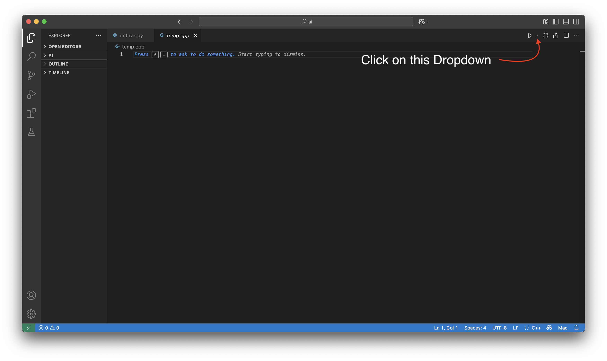
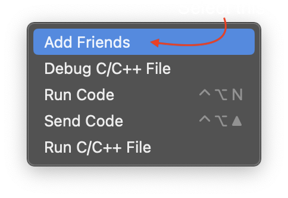
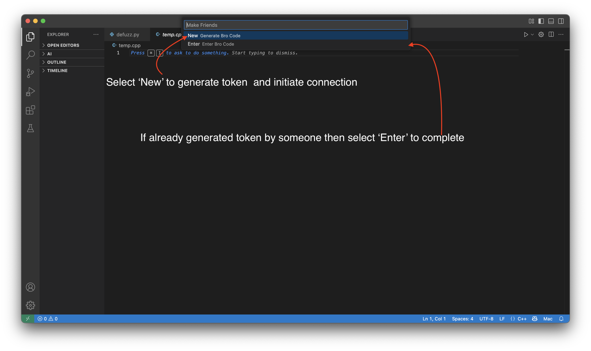
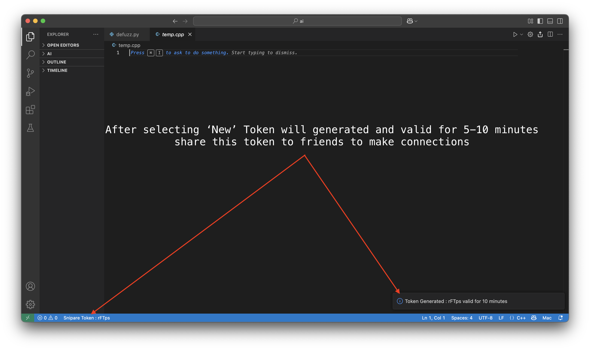
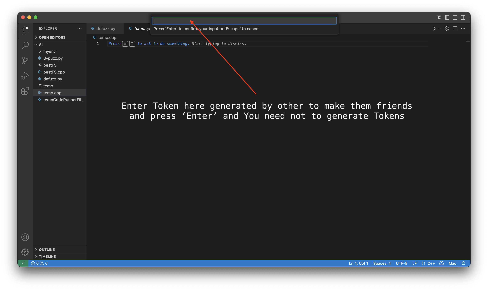
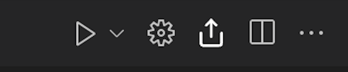
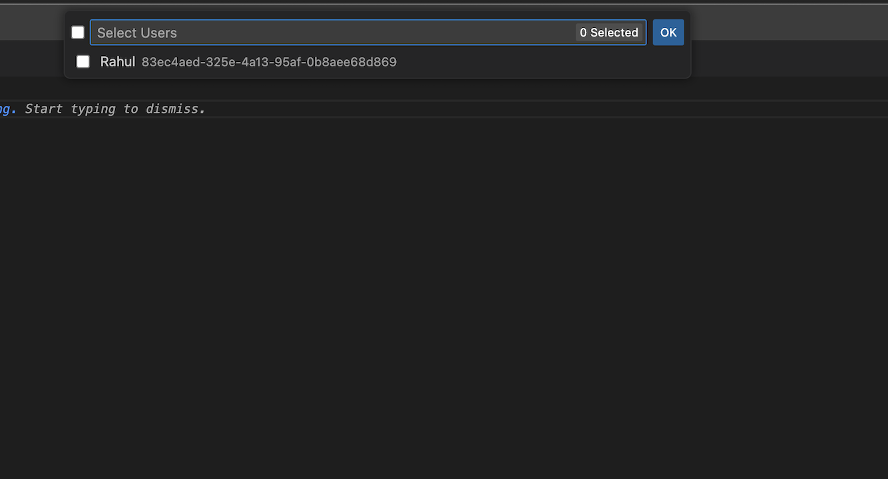
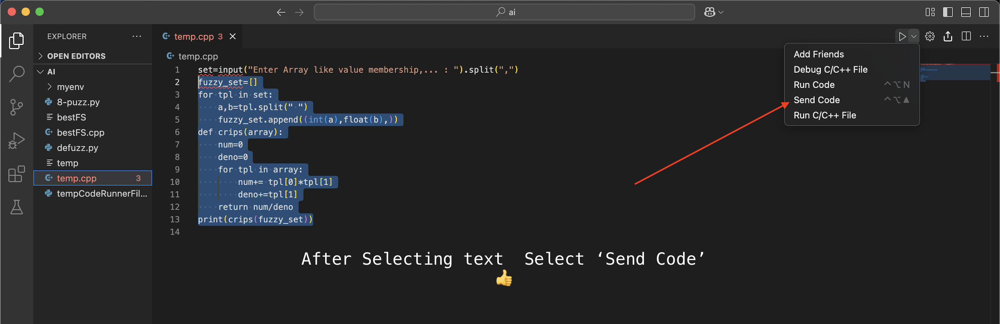

# Snip Share 
In this profession, everyone often needs to share files or code snippets. As students, we frequently had to share code instantly during labs or group projects. Most of us relied on third-party apps like WhatsApp and Telegram, but we sometimes hesitated to open them publicly. I personally faced this issue many times, which inspired me to create a VS Code extension for seamless, in-IDE file and code sharing—no context switching, no third-party tools.
This VS Code extension aims to bridge that gap by enabling users to share code and files directly from one VS Code instance to another.

## Features
* Send File of any language to any friend
* Send Selected Code/Message  of any language to any friend
* Add Friends via token module
* Block/Unblock Friend

# Usages

### 1. How to make Connections/Friends
* Click Dropdown button besides run and select Add Friends or Go to Command Palette (via `cmd+shift+p` for mac and `ctrl+shift+p` for windows/linux)
 
 
* Now there are 2 options
  * Either you have to generate New Token and your friends will enter this token in their VS Code within 5 minutes
  * Or you will enter token generated by your friends

# OR

> Congrats, Now you can share you files/code to your friends

### 2. Send File
* Click Send Button shown below or in Command Palette Type and select `Send File`

* A list of friend's will open where you can select multiple friends and click ok

* Hurrah file sent to Selected Friends

### 3. Send Code
* Select the Portion of Code in any file
* Either click Send Code(Given Below) or Shortcut key `ctrl+alt+up` or `ctrl+option+up`  or in Command Palette type `Send Code`
* Again selection window/list open and send

### 4. Block/Unblock Friends
* Go to Command Palette and select  `Block Friend`  to Block and `Unblock Friends` to unblock.

## Requirements

* Vscode Version must more than  `1.30.0`  or Vscode install after `2018`
* Use SnipShare version after `1.0.6` before this extension will not work

## Release Notes

### 1.0.6
* Functional Version
### 1.0.0
* Initial release of Snip Share

## Contribution
* [Repository](https://github.com/its-Yogesh123/snipShare.git)

## Financial Contribution

## For more information

* [Error Logs](http://snipshare.yolab.in/)
* [Repo](https://github.com/its-Yogesh123/snipShare.git)
* Support : `support@yolab.in`

## Team 
- Yogesh Kumar
  - [LinkedIn](https://www.linkedin.com/in/yogeshkumardev123)
  - [Profile](https://github.com/its-Yogesh123)
  - Wanna Join ?? DM on linkedIn

**Enjoy!**